### Evidencia: Probar y verificar el despliegue de la aplicación

1. Se creó la instancia "hack-03" con una clave "labuser.pem". Se editaron las reglas de entrada, agregando un TCP personalizado para que tenga acceso al puerto 8080.

   

     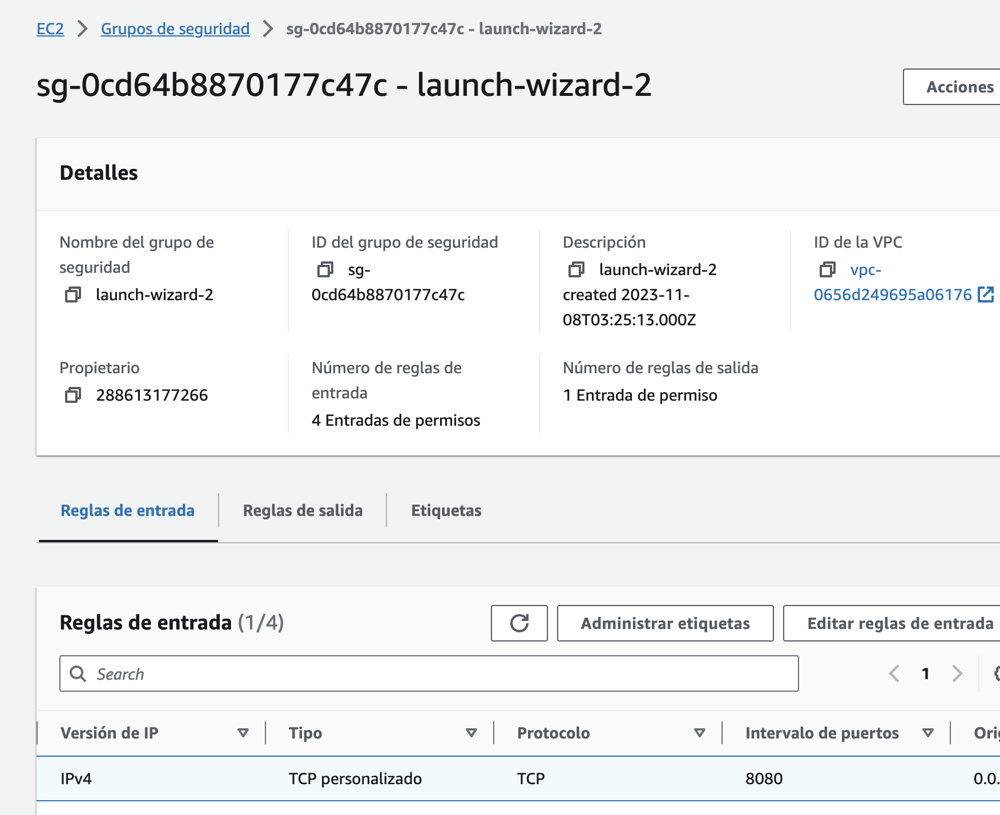
   

2. Se ingresó al entorno virtual utilizando SSH: `ssh -i /Users/bladimiralferez/labsuser.pem ubuntu@34.229.173.66`, y se instaló Java y PostgreSQL.

   

     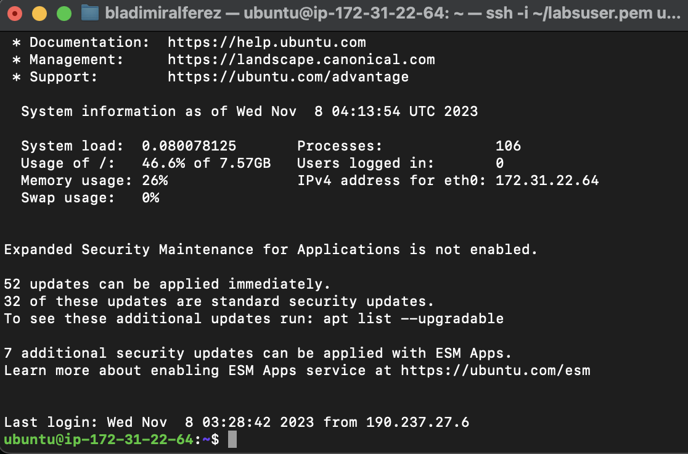
   

3. Se creó la base de datos hack-03 en RDS.

   

     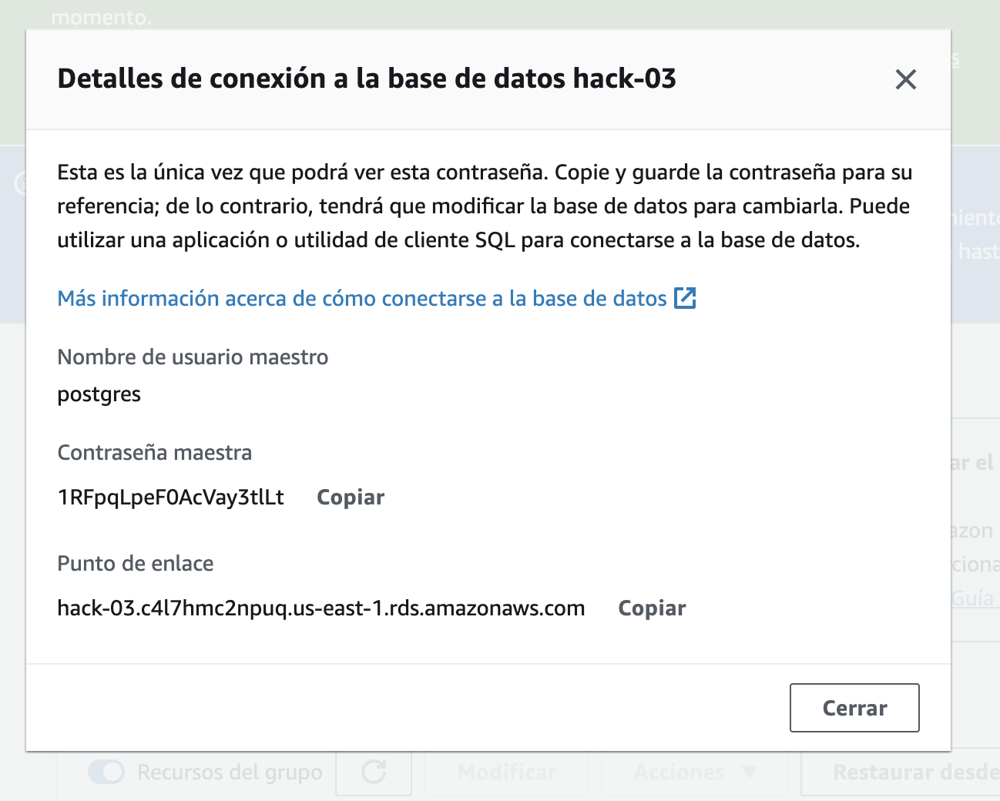
   

4. Se empacó la aplicación en un archivo sem08-0.0.1-SNAPSHOT.jar .

   

     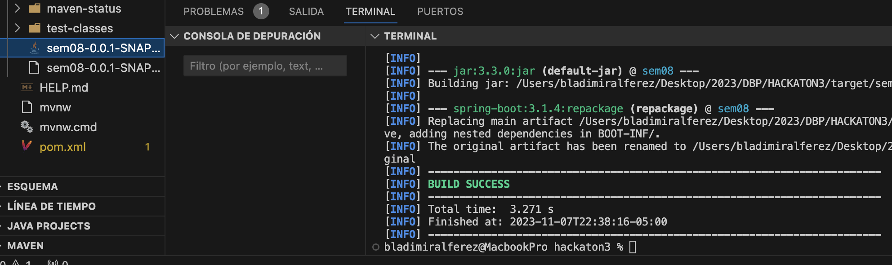
   

5. Se creó el bucket "hack-03" donde se subirá el archivo .jar.

   

     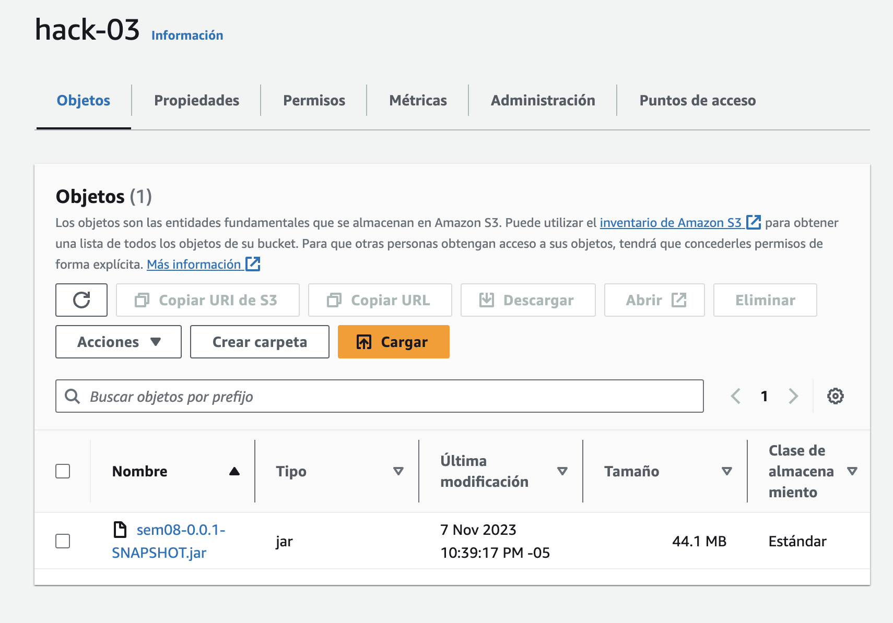
   

6. Se cargó correctamente el archivo .jar en el bucket.

    

      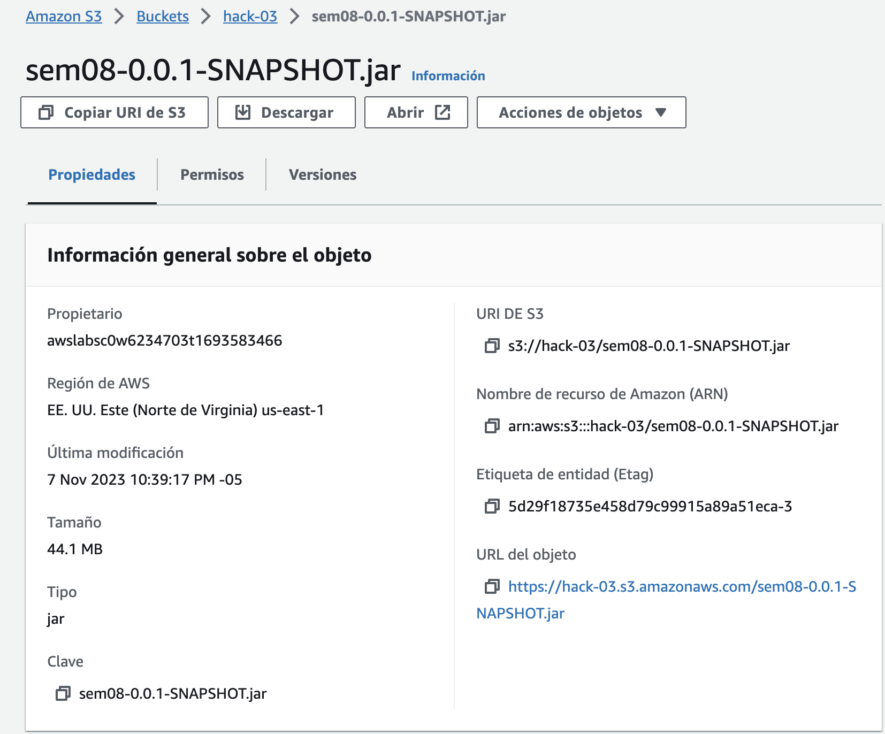
    

7. Se copió la aplicación de Spring Boot en la instancia de EC2 usando el comando: `aws s3 cp s3://hack-03/sem08-0.0.1-SNAPSHOT.jar /home/ubuntu/sem08-0.0.1-SNAPSHOT.jar`.

    

      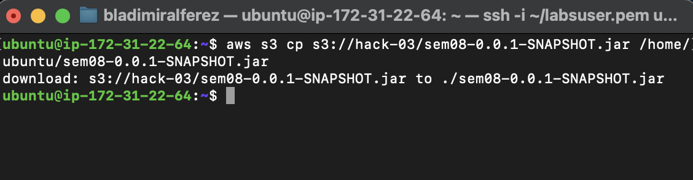
    

8. Ejecutamos la aplicación usando el comando: `java -jar sem08-0.0.1-SNAPSHOT.jar`

    

      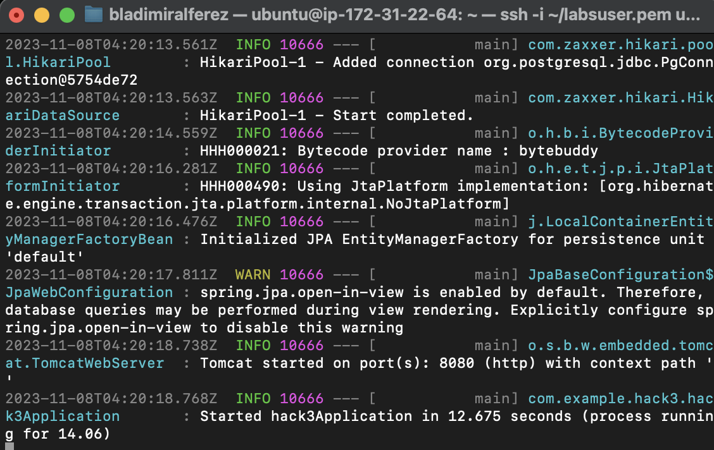
    

9. Utilizando Postman, se hicieron los Request dentro de la aplicación para comprobar el funcionamiento. Se hizo un POST, GET, GET/id , PUT. y DELETE. 

    

      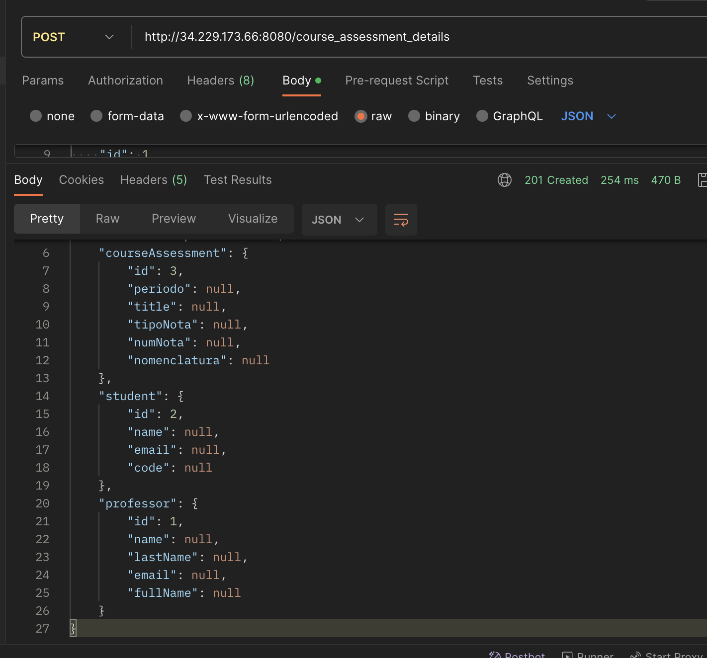
    

    

      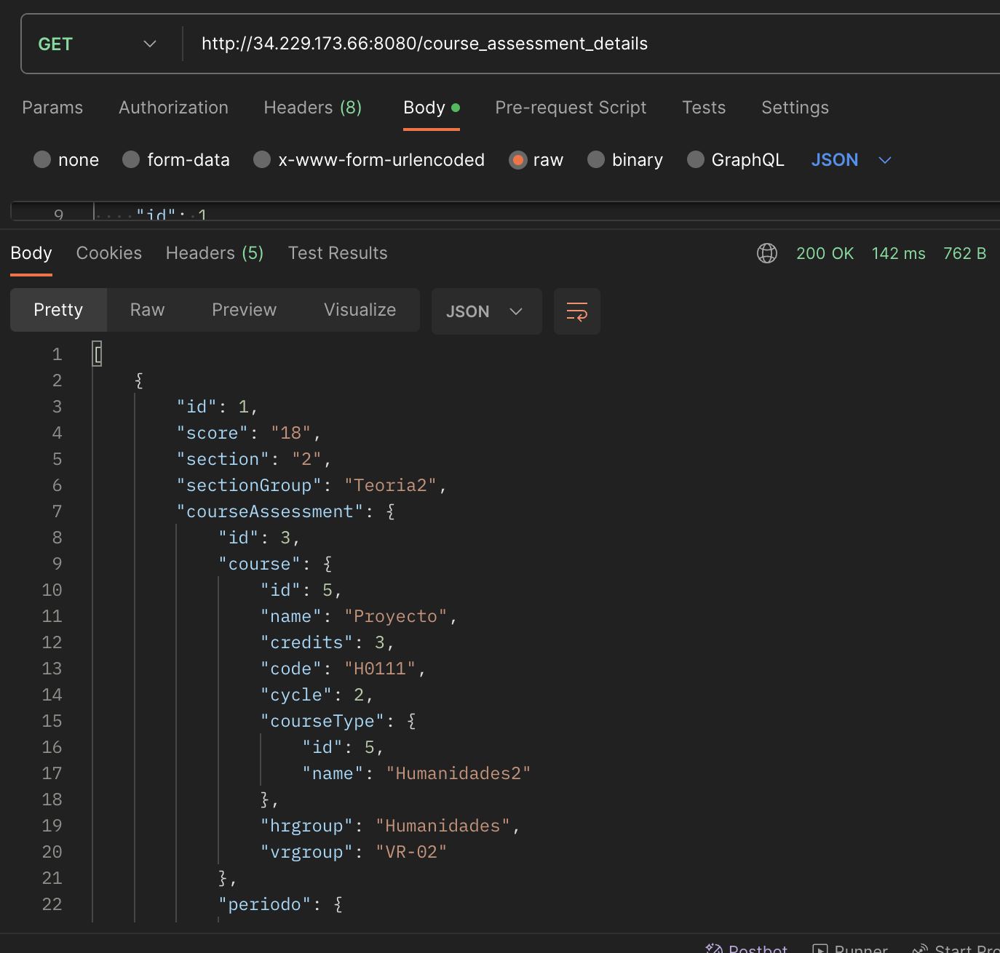
    

    

      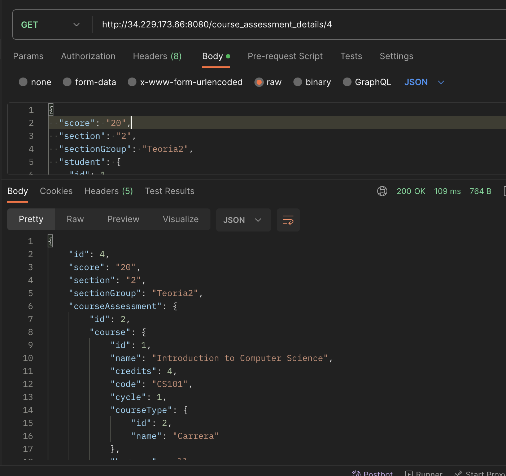
    

    

      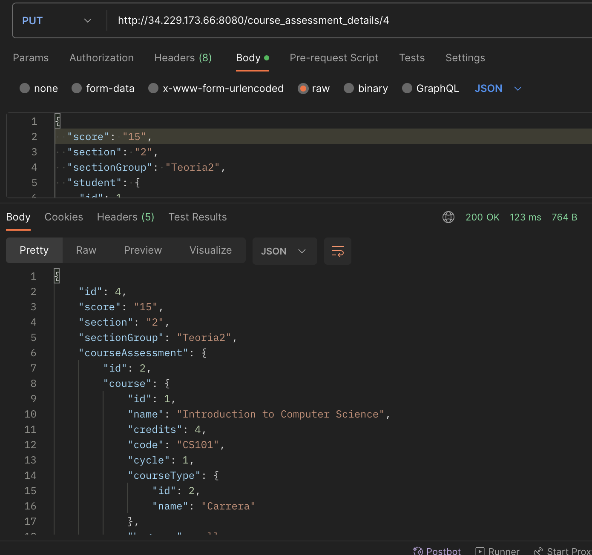
    

    

      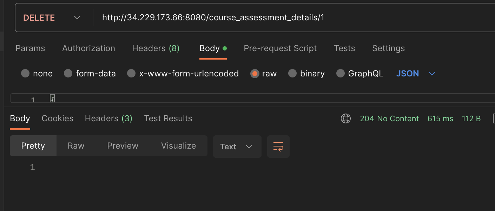
    

